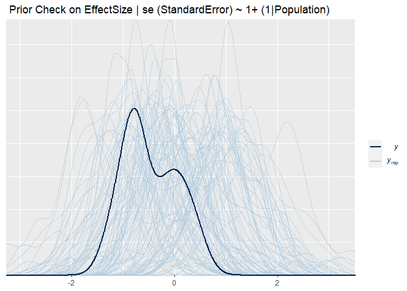
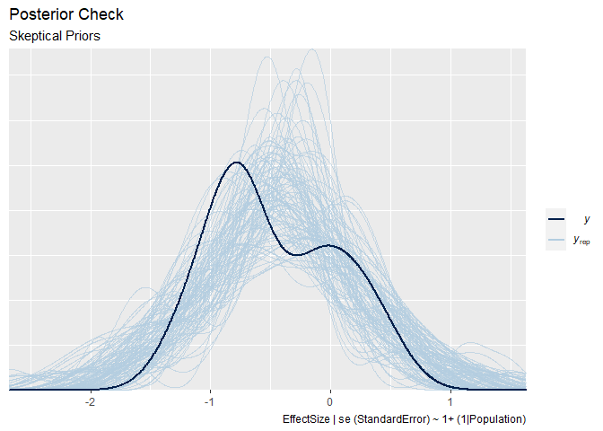

Assignment 4 - Applying meta-analytic priors
================
Riccardo Fusaroli

## Assignment 4

In this assignment we do the following: - we run a Bayesian
meta-analysis of pitch variability in ASD, based on previously published
literature - we analyze pitch variability in ASD in two new studies
using both a conservative and a meta-analytic prior - we assess the
difference in model quality and estimates using the two priors.

The questions you need to answer are: What are the consequences of using
a meta-analytic prior? Evaluate the models with conservative and
meta-analytic priors. Discuss the effects on estimates. Discuss the
effects on model quality. Discuss the role that meta-analytic priors
should have in scientific practice. Should we systematically use them?
Do they have drawbacks? Should we use them to complement more
conservative approaches? How does the use of meta-analytic priors you
suggest reflect the skeptical and cumulative nature of science?

### Step by step suggestions

Step 1: Perform a meta-analysis of pitch variability from previous
studies of voice in ASD - the data is available as
Ass4\_MetaAnalysisData.tsv - You should calculate Effect size (cohen’s
d) and Standard Error (uncertainty in the Cohen’s d) per each study,
using escalc() from the metafor package (also check the livecoding
intro) - N.B. we’re only interested in getting a meta-analytic effect
size for the meta-analytic prior (and not e.g. all the stuff on
publication bias). See a brms tutorial here:
<https://vuorre.netlify.com/post/2016/09/29/meta-analysis-is-a-special-case-of-bayesian-multilevel-modeling/>
The formula is EffectSize | se(StandardError) \~ 1 + (1 | Paper). Don’t
forget prior definition, model checking, etc. - Write down the results
of the meta-analysis in terms of a prior for step 2.

``` r
#load data and packages

pacman::p_load(pacman, tidyverse, brms,psych,metafor, parallel)

cores = detectCores()

dataMetaAnalysis <- read_delim("Ass4_MetaAnalysisData.tsv", 
    "\t")
```

    ## Parsed with column specification:
    ## cols(
    ##   .default = col_double(),
    ##   Paper = col_character(),
    ##   Author = col_character(),
    ##   Population = col_character(),
    ##   DiagnosisDetails = col_character(),
    ##   Language = col_character(),
    ##   Language2 = col_character(),
    ##   Task = col_character(),
    ##   Task2 = col_character(),
    ##   PitchMean_Units = col_character(),
    ##   PitchMeanASDvsTD = col_character(),
    ##   PitchRange_Units = col_character(),
    ##   PitchRangeASDvsTD = col_character(),
    ##   PitchSD_Units = col_character(),
    ##   PitchSDASDvsTD = col_character(),
    ##   PitchVariability_Units = col_character(),
    ##   PitchVariabilityASDvsTD = col_character(),
    ##   IntensityMean_Units = col_character(),
    ##   IntensityMeanASDvsTD = col_character(),
    ##   UtteranceDurationUnit = col_character(),
    ##   UtteranceDurationASDvsTD = col_character()
    ##   # ... with 5 more columns
    ## )

    ## See spec(...) for full column specifications.

``` r
dataMetaAnalysis <- dataMetaAnalysis %>% 
  mutate_at(c("PitchVariabilityASD_Mean","PitchVariabilityASD_SD","PitchVariabilityTD_Mean","PitchVariabilityTD_SD"),as.numeric)

describe(dataMetaAnalysis)
```

    ## Warning in describe(dataMetaAnalysis): NAs introduced by coercion
    
    ## Warning in describe(dataMetaAnalysis): NAs introduced by coercion
    
    ## Warning in describe(dataMetaAnalysis): NAs introduced by coercion
    
    ## Warning in describe(dataMetaAnalysis): NAs introduced by coercion
    
    ## Warning in describe(dataMetaAnalysis): NAs introduced by coercion
    
    ## Warning in describe(dataMetaAnalysis): NAs introduced by coercion
    
    ## Warning in describe(dataMetaAnalysis): NAs introduced by coercion
    
    ## Warning in describe(dataMetaAnalysis): NAs introduced by coercion
    
    ## Warning in describe(dataMetaAnalysis): NAs introduced by coercion
    
    ## Warning in describe(dataMetaAnalysis): NAs introduced by coercion
    
    ## Warning in describe(dataMetaAnalysis): NAs introduced by coercion
    
    ## Warning in describe(dataMetaAnalysis): NAs introduced by coercion
    
    ## Warning in describe(dataMetaAnalysis): NAs introduced by coercion
    
    ## Warning in describe(dataMetaAnalysis): NAs introduced by coercion
    
    ## Warning in describe(dataMetaAnalysis): NAs introduced by coercion
    
    ## Warning in describe(dataMetaAnalysis): NAs introduced by coercion
    
    ## Warning in describe(dataMetaAnalysis): NAs introduced by coercion
    
    ## Warning in describe(dataMetaAnalysis): NAs introduced by coercion
    
    ## Warning in describe(dataMetaAnalysis): NAs introduced by coercion
    
    ## Warning in describe(dataMetaAnalysis): NAs introduced by coercion
    
    ## Warning in describe(dataMetaAnalysis): NAs introduced by coercion
    
    ## Warning in describe(dataMetaAnalysis): NAs introduced by coercion
    
    ## Warning in describe(dataMetaAnalysis): NAs introduced by coercion
    
    ## Warning in describe(dataMetaAnalysis): NAs introduced by coercion
    
    ## Warning in describe(dataMetaAnalysis): NAs introduced by coercion

    ## Warning in FUN(newX[, i], ...): no non-missing arguments to min; returning Inf
    
    ## Warning in FUN(newX[, i], ...): no non-missing arguments to min; returning Inf
    
    ## Warning in FUN(newX[, i], ...): no non-missing arguments to min; returning Inf
    
    ## Warning in FUN(newX[, i], ...): no non-missing arguments to min; returning Inf
    
    ## Warning in FUN(newX[, i], ...): no non-missing arguments to min; returning Inf
    
    ## Warning in FUN(newX[, i], ...): no non-missing arguments to min; returning Inf
    
    ## Warning in FUN(newX[, i], ...): no non-missing arguments to min; returning Inf
    
    ## Warning in FUN(newX[, i], ...): no non-missing arguments to min; returning Inf
    
    ## Warning in FUN(newX[, i], ...): no non-missing arguments to min; returning Inf
    
    ## Warning in FUN(newX[, i], ...): no non-missing arguments to min; returning Inf
    
    ## Warning in FUN(newX[, i], ...): no non-missing arguments to min; returning Inf
    
    ## Warning in FUN(newX[, i], ...): no non-missing arguments to min; returning Inf
    
    ## Warning in FUN(newX[, i], ...): no non-missing arguments to min; returning Inf
    
    ## Warning in FUN(newX[, i], ...): no non-missing arguments to min; returning Inf
    
    ## Warning in FUN(newX[, i], ...): no non-missing arguments to min; returning Inf
    
    ## Warning in FUN(newX[, i], ...): no non-missing arguments to min; returning Inf
    
    ## Warning in FUN(newX[, i], ...): no non-missing arguments to min; returning Inf
    
    ## Warning in FUN(newX[, i], ...): no non-missing arguments to min; returning Inf
    
    ## Warning in FUN(newX[, i], ...): no non-missing arguments to min; returning Inf
    
    ## Warning in FUN(newX[, i], ...): no non-missing arguments to min; returning Inf
    
    ## Warning in FUN(newX[, i], ...): no non-missing arguments to min; returning Inf
    
    ## Warning in FUN(newX[, i], ...): no non-missing arguments to min; returning Inf
    
    ## Warning in FUN(newX[, i], ...): no non-missing arguments to min; returning Inf
    
    ## Warning in FUN(newX[, i], ...): no non-missing arguments to min; returning Inf
    
    ## Warning in FUN(newX[, i], ...): no non-missing arguments to min; returning Inf

    ## Warning in FUN(newX[, i], ...): no non-missing arguments to max; returning -Inf
    
    ## Warning in FUN(newX[, i], ...): no non-missing arguments to max; returning -Inf
    
    ## Warning in FUN(newX[, i], ...): no non-missing arguments to max; returning -Inf
    
    ## Warning in FUN(newX[, i], ...): no non-missing arguments to max; returning -Inf
    
    ## Warning in FUN(newX[, i], ...): no non-missing arguments to max; returning -Inf
    
    ## Warning in FUN(newX[, i], ...): no non-missing arguments to max; returning -Inf
    
    ## Warning in FUN(newX[, i], ...): no non-missing arguments to max; returning -Inf
    
    ## Warning in FUN(newX[, i], ...): no non-missing arguments to max; returning -Inf
    
    ## Warning in FUN(newX[, i], ...): no non-missing arguments to max; returning -Inf
    
    ## Warning in FUN(newX[, i], ...): no non-missing arguments to max; returning -Inf
    
    ## Warning in FUN(newX[, i], ...): no non-missing arguments to max; returning -Inf
    
    ## Warning in FUN(newX[, i], ...): no non-missing arguments to max; returning -Inf
    
    ## Warning in FUN(newX[, i], ...): no non-missing arguments to max; returning -Inf
    
    ## Warning in FUN(newX[, i], ...): no non-missing arguments to max; returning -Inf
    
    ## Warning in FUN(newX[, i], ...): no non-missing arguments to max; returning -Inf
    
    ## Warning in FUN(newX[, i], ...): no non-missing arguments to max; returning -Inf
    
    ## Warning in FUN(newX[, i], ...): no non-missing arguments to max; returning -Inf
    
    ## Warning in FUN(newX[, i], ...): no non-missing arguments to max; returning -Inf
    
    ## Warning in FUN(newX[, i], ...): no non-missing arguments to max; returning -Inf
    
    ## Warning in FUN(newX[, i], ...): no non-missing arguments to max; returning -Inf
    
    ## Warning in FUN(newX[, i], ...): no non-missing arguments to max; returning -Inf
    
    ## Warning in FUN(newX[, i], ...): no non-missing arguments to max; returning -Inf
    
    ## Warning in FUN(newX[, i], ...): no non-missing arguments to max; returning -Inf
    
    ## Warning in FUN(newX[, i], ...): no non-missing arguments to max; returning -Inf
    
    ## Warning in FUN(newX[, i], ...): no non-missing arguments to max; returning -Inf

    ##                           vars  n    mean      sd  median trimmed    mad
    ## Paper*                       1 41     NaN      NA      NA     NaN     NA
    ## Author*                      2 41     NaN      NA      NA     NaN     NA
    ## Year                         3 41 2011.37    6.66 2013.00 2012.61   4.45
    ## Population*                  4 41     NaN      NA      NA     NaN     NA
    ## DiagnosisDetails*            5 41     NaN      NA      NA     NaN     NA
    ## Language*                    6 41     NaN      NA      NA     NaN     NA
    ## Language2*                   7 41     NaN      NA      NA     NaN     NA
    ## Task*                        8 41     NaN      NA      NA     NaN     NA
    ## Task2*                       9 41     NaN      NA      NA     NaN     NA
    ## ASD_N                       10 41   20.66   15.53   15.00   17.55   7.41
    ## TD_N                        11 41   19.66   16.31   17.00   16.79   7.41
    ## GenderMaleASD               12 38   16.03   11.21   13.00   14.19   4.45
    ## GenderMaleTD                13 37   12.19    6.72   10.00   11.45   5.93
    ## AgeASD_Mean                 14 40  171.43  132.66  131.63  154.72  51.86
    ## AgeASD_SD                   15 35   42.70   78.27   18.96   25.12  19.04
    ## AgeTD_Mean                  16 39  166.69  132.91  130.54  150.47  55.66
    ## AgeTD_SD                    17 34   30.66   34.41   23.93   23.90  18.32
    ## IndividualData              18 41    0.34    0.48    0.00    0.30   0.00
    ## PitchMean_Units*            19 25     NaN      NA      NA     NaN     NA
    ## PitchMeanASD_Mean           20 25  226.48   88.77  225.43  226.43  84.33
    ## PitchMeanASD_SD             21 25   41.99   24.72   36.13   39.20  17.65
    ## PitchMeanTD_Mean            22 25  209.59   83.75  207.84  208.02  77.12
    ## PitchMeanTD_SD              23 25   31.54   17.01   30.41   30.37  14.22
    ## PitchMeanASDvsTD*           24 18     NaN      NA      NA     NaN     NA
    ## PitchRange_Units*           25 14     NaN      NA      NA     NaN     NA
    ## PitchRangeASD_Mean          26 24  196.25  170.54  179.59  178.03 115.18
    ## PitchRangeASD_SD            27 23   58.98   61.13   46.98   48.56  24.98
    ## PitchRangeTD_Mean           28 24  168.82  160.54  128.51  147.30 142.22
    ## PitchRangeTD_SD             29 23   44.14   50.35   37.00   34.01  25.12
    ## PitchRangeASDvsTD*          30 19     NaN      NA      NA     NaN     NA
    ## PitchSD_Units*              31  7     NaN      NA      NA     NaN     NA
    ## PitchSDASD_Mean             32 19   49.30   24.82   49.57   48.96  18.26
    ## PitchSDASD_SD               33 19   22.06   23.59   12.32   18.99   6.61
    ## PitchSDTD_Mean              34 19   42.71   23.09   41.69   42.17  24.78
    ## PitchSDTD_SD                35 19   16.46   17.71   12.49   13.71   9.28
    ## PitchSDASDvsTD*             36 11     NaN      NA      NA     NaN     NA
    ## PitchVariability_Units*     37 14     NaN      NA      NA     NaN     NA
    ## PitchVariabilityASD_Mean    38 31  161.07  163.61  135.43  131.57 135.66
    ## PitchVariabilityASD_SD      39 30   48.03   57.04   35.20   35.88  37.01
    ## PitchVariabilityTD_Mean     40 31  138.95  151.65  108.64  109.47 128.22
    ## PitchVariabilityTD_SD       41 30   37.36   45.91   27.04   28.45  29.40
    ## PitchVariabilityASDvsTD*    42 19     NaN      NA      NA     NaN     NA
    ## IntensityMean_Units*        43  6     NaN      NA      NA     NaN     NA
    ## IntensityMeanASD_Mean       44 15   64.74    9.23   66.28   65.12   8.85
    ## IntensityMeanASD_SD         45 15    4.51    3.31    3.32    4.13   1.70
    ## IntensityMeanTD_Mean        46 15   65.03    5.95   64.90   65.10   7.81
    ## IntensityMeanTD_SD          47 15    4.51    2.40    4.31    4.36   2.30
    ## IntensityMeanASDvsTD*       48  8     NaN      NA      NA     NaN     NA
    ## UtteranceDurationUnit*      49  5     NaN      NA      NA     NaN     NA
    ## UtteranceDurationASD_Mean   50 18  145.37  330.48   30.51   85.87  35.01
    ## UtteranceDurationASD_SD     51 17   43.77   76.82   11.78   31.24  17.27
    ## UtteranceDurationTD_Mean    52 18  133.86  305.78   25.29   80.26  28.62
    ## UtteranceDurationTD_SD      53 17   22.47   38.03    9.49   16.75  12.60
    ## UtteranceDurationASDvsTD*   54 13     NaN      NA      NA     NaN     NA
    ## SyllableDurationASD_Mean    55 10    0.32    0.21    0.26    0.27   0.04
    ## SyllableDurationASD_SD      56 10    0.07    0.05    0.05    0.06   0.04
    ## SyllableDurationTD_Mean     57 10    0.32    0.17    0.24    0.28   0.04
    ## SyllableDurationTD_SD       58 10    0.06    0.06    0.04    0.04   0.04
    ## SyllableDurationASDvsTD*    59  2     NaN      NA      NA     NaN     NA
    ## SpeechRate_Units*           60  4     NaN      NA      NA     NaN     NA
    ## SpeechRateASD_Mean          61 13   34.12   69.65    3.66   21.25   0.47
    ## SpeechRateASD_SD            62 12    8.32   17.97    0.76    4.62   0.26
    ## SpeechRateTD_Mean           63 13   32.43   65.24    3.88   19.52   0.45
    ## SpeechRateTD_SD             64 12    8.86   19.53    0.51    4.91   0.24
    ## SpeechRateASDvsTD*          65  5     NaN      NA      NA     NaN     NA
    ## PauseLengthASD_Mean         66  9   26.42   36.51    1.48   26.42   1.27
    ## PauseLengthASD_SD           67  9    9.81   14.47    0.58    9.81   0.43
    ## PauseLengthTD_Mean          68  9   22.37   32.76    1.13   22.37   0.87
    ## PauseLengthTD_SD            69  9    2.64    4.16    0.40    2.64   0.46
    ## PauseLengthASDvsTD*         70  1     NaN      NA      NA     NaN     NA
    ## PauseNumberASD              71  9  656.90 1854.16   11.23  656.90   9.13
    ## PauseNumberASD_SD           72  9  146.70  361.45    8.30  146.70   6.59
    ## PauseNumberTD               73  9  687.25 1982.32    9.92  687.25   7.50
    ## PauseNumberTD_SD            74  9  134.06  353.85    5.01  134.06   2.90
    ## PauseNumberASDvsTD*         75  1     NaN      NA      NA     NaN     NA
    ##                               min     max   range  skew kurtosis     se
    ## Paper*                        Inf    -Inf    -Inf    NA       NA     NA
    ## Author*                       Inf    -Inf    -Inf    NA       NA     NA
    ## Year                      1982.00 2018.00   36.00 -2.64     8.05   1.04
    ## Population*                   Inf    -Inf    -Inf    NA       NA     NA
    ## DiagnosisDetails*             Inf    -Inf    -Inf    NA       NA     NA
    ## Language*                     Inf    -Inf    -Inf    NA       NA     NA
    ## Language2*                    Inf    -Inf    -Inf    NA       NA     NA
    ## Task*                         Inf    -Inf    -Inf    NA       NA     NA
    ## Task2*                        Inf    -Inf    -Inf    NA       NA     NA
    ## ASD_N                        4.00   77.00   73.00  1.96     3.61   2.43
    ## TD_N                         4.00  106.00  102.00  3.68    16.43   2.55
    ## GenderMaleASD                4.00   50.00   46.00  1.70     2.41   1.82
    ## GenderMaleTD                 3.00   31.00   28.00  1.00     0.52   1.10
    ## AgeASD_Mean                  4.38  551.29  546.91  1.24     0.99  20.97
    ## AgeASD_SD                    0.85  431.99  431.14  3.70    14.85  13.23
    ## AgeTD_Mean                   3.71  591.53  587.82  1.61     2.83  21.28
    ## AgeTD_SD                     0.47  145.91  145.44  1.98     3.52   5.90
    ## IndividualData               0.00    1.00    1.00  0.64    -1.62   0.07
    ## PitchMean_Units*              Inf    -Inf    -Inf    NA       NA     NA
    ## PitchMeanASD_Mean            8.02  393.61  385.59  0.04     0.05  17.75
    ## PitchMeanASD_SD              0.24  107.19  106.95  1.08     0.89   4.94
    ## PitchMeanTD_Mean             8.01  377.08  369.07  0.11     0.06  16.75
    ## PitchMeanTD_SD               0.10   78.89   78.79  0.71     0.78   3.40
    ## PitchMeanASDvsTD*             Inf    -Inf    -Inf    NA       NA     NA
    ## PitchRange_Units*             Inf    -Inf    -Inf    NA       NA     NA
    ## PitchRangeASD_Mean           1.83  586.07  584.24  0.95     0.19  34.81
    ## PitchRangeASD_SD             0.09  252.61  252.52  1.65     2.43  12.75
    ## PitchRangeTD_Mean            1.47  562.39  560.92  1.11     0.47  32.77
    ## PitchRangeTD_SD              0.00  216.85  216.85  2.02     4.10  10.50
    ## PitchRangeASDvsTD*            Inf    -Inf    -Inf    NA       NA     NA
    ## PitchSD_Units*                Inf    -Inf    -Inf    NA       NA     NA
    ## PitchSDASD_Mean              0.48  103.78  103.30  0.49     0.16   5.69
    ## PitchSDASD_SD                0.16   96.14   95.98  1.82     2.67   5.41
    ## PitchSDTD_Mean               0.36   94.24   93.88  0.46    -0.35   5.30
    ## PitchSDTD_SD                 0.18   79.42   79.24  2.31     5.57   4.06
    ## PitchSDASDvsTD*               Inf    -Inf    -Inf    NA       NA     NA
    ## PitchVariability_Units*       Inf    -Inf    -Inf    NA       NA     NA
    ## PitchVariabilityASD_Mean     0.48  586.07  585.59  1.26     0.94  29.38
    ## PitchVariabilityASD_SD       0.09  252.61  252.52  1.99     3.93  10.41
    ## PitchVariabilityTD_Mean      0.36  562.39  562.03  1.44     1.43  27.24
    ## PitchVariabilityTD_SD        0.00  216.85  216.85  2.39     6.22   8.38
    ## PitchVariabilityASDvsTD*      Inf    -Inf    -Inf    NA       NA     NA
    ## IntensityMean_Units*          Inf    -Inf    -Inf    NA       NA     NA
    ## IntensityMeanASD_Mean       47.41   77.13   29.72 -0.59    -0.87   2.38
    ## IntensityMeanASD_SD          1.29   12.63   11.33  1.32     0.51   0.86
    ## IntensityMeanTD_Mean        54.11   75.12   21.01 -0.03    -1.18   1.54
    ## IntensityMeanTD_SD           1.45    9.48    8.03  0.53    -0.79   0.62
    ## IntensityMeanASDvsTD*         Inf    -Inf    -Inf    NA       NA     NA
    ## UtteranceDurationUnit*        Inf    -Inf    -Inf    NA       NA     NA
    ## UtteranceDurationASD_Mean    0.40 1242.44 1242.04  2.40     4.57  77.90
    ## UtteranceDurationASD_SD      0.00  275.60  275.60  1.89     2.46  18.63
    ## UtteranceDurationTD_Mean     0.38 1124.98 1124.61  2.35     4.19  72.07
    ## UtteranceDurationTD_SD       0.00  130.78  130.77  1.85     2.06   9.22
    ## UtteranceDurationASDvsTD*     Inf    -Inf    -Inf    NA       NA     NA
    ## SyllableDurationASD_Mean     0.21    0.90    0.69  2.16     3.23   0.06
    ## SyllableDurationASD_SD       0.02    0.17    0.15  0.86    -0.77   0.02
    ## SyllableDurationTD_Mean      0.21    0.76    0.55  1.73     1.88   0.05
    ## SyllableDurationTD_SD        0.01    0.20    0.19  1.49     1.24   0.02
    ## SyllableDurationASDvsTD*      Inf    -Inf    -Inf    NA       NA     NA
    ## SpeechRate_Units*             Inf    -Inf    -Inf    NA       NA     NA
    ## SpeechRateASD_Mean           2.83  206.97  204.14  1.71     1.13  19.32
    ## SpeechRateASD_SD             0.42   53.20   52.78  1.66     1.01   5.19
    ## SpeechRateTD_Mean            2.66  204.19  201.53  1.77     1.48  18.10
    ## SpeechRateTD_SD              0.34   56.87   56.53  1.64     0.90   5.64
    ## SpeechRateASDvsTD*            Inf    -Inf    -Inf    NA       NA     NA
    ## PauseLengthASD_Mean          0.63   88.90   88.28  0.71    -1.47  12.17
    ## PauseLengthASD_SD            0.29   40.04   39.75  1.06    -0.54   4.82
    ## PauseLengthTD_Mean           0.54   91.11   90.57  0.97    -0.65  10.92
    ## PauseLengthTD_SD             0.00   11.67   11.67  1.15    -0.30   1.39
    ## PauseLengthASDvsTD*           Inf    -Inf    -Inf    NA       NA     NA
    ## PauseNumberASD               2.81 5596.88 5594.07  2.07     2.61 618.05
    ## PauseNumberASD_SD            1.86 1099.25 1097.39  1.99     2.38 120.48
    ## PauseNumberTD                1.11 5971.88 5970.77  2.07     2.62 660.77
    ## PauseNumberTD_SD             1.18 1073.35 1072.17  2.04     2.53 117.95
    ## PauseNumberASDvsTD*           Inf    -Inf    -Inf    NA       NA     NA

``` r
head(dataMetaAnalysis)
```

    ## # A tibble: 6 x 75
    ##   Paper Author  Year Population DiagnosisDetails Language Language2 Task  Task2
    ##   <chr> <chr>  <dbl> <chr>      <chr>            <chr>    <chr>     <chr> <chr>
    ## 1 (Sha~ Sharda  2010 A          ASD              English  Hindi-En~ Soci~ Soci~
    ## 2 (Fil~ Filipe  2014 B          Aspergers        Portugu~ Portugue~ Spon~ Lexi~
    ## 3 (Fil~ Filipe  2014 B          Aspergers        Portugu~ Portugue~ Spon~ Lexi~
    ## 4 (Die~ Diehl   2009 C          HFA              English  American~ Spon~ Narr~
    ## 5 (Die~ Diehl   2009 D          HFA              English  American~ Spon~ Narr~
    ## 6 (Sch~ Schar~  2011 E          Aspergers        English  American~ Soci~ Soci~
    ## # ... with 66 more variables: ASD_N <dbl>, TD_N <dbl>, GenderMaleASD <dbl>,
    ## #   GenderMaleTD <dbl>, AgeASD_Mean <dbl>, AgeASD_SD <dbl>, AgeTD_Mean <dbl>,
    ## #   AgeTD_SD <dbl>, IndividualData <dbl>, PitchMean_Units <chr>,
    ## #   PitchMeanASD_Mean <dbl>, PitchMeanASD_SD <dbl>, PitchMeanTD_Mean <dbl>,
    ## #   PitchMeanTD_SD <dbl>, PitchMeanASDvsTD <chr>, PitchRange_Units <chr>,
    ## #   PitchRangeASD_Mean <dbl>, PitchRangeASD_SD <dbl>, PitchRangeTD_Mean <dbl>,
    ## #   PitchRangeTD_SD <dbl>, PitchRangeASDvsTD <chr>, PitchSD_Units <chr>,
    ## #   PitchSDASD_Mean <dbl>, PitchSDASD_SD <dbl>, PitchSDTD_Mean <dbl>,
    ## #   PitchSDTD_SD <dbl>, PitchSDASDvsTD <chr>, PitchVariability_Units <chr>,
    ## #   PitchVariabilityASD_Mean <dbl>, PitchVariabilityASD_SD <dbl>,
    ## #   PitchVariabilityTD_Mean <dbl>, PitchVariabilityTD_SD <dbl>,
    ## #   PitchVariabilityASDvsTD <chr>, IntensityMean_Units <chr>,
    ## #   IntensityMeanASD_Mean <dbl>, IntensityMeanASD_SD <dbl>,
    ## #   IntensityMeanTD_Mean <dbl>, IntensityMeanTD_SD <dbl>,
    ## #   IntensityMeanASDvsTD <chr>, UtteranceDurationUnit <chr>,
    ## #   UtteranceDurationASD_Mean <dbl>, UtteranceDurationASD_SD <dbl>,
    ## #   UtteranceDurationTD_Mean <dbl>, UtteranceDurationTD_SD <dbl>,
    ## #   UtteranceDurationASDvsTD <chr>, SyllableDurationASD_Mean <dbl>,
    ## #   SyllableDurationASD_SD <dbl>, SyllableDurationTD_Mean <dbl>,
    ## #   SyllableDurationTD_SD <dbl>, SyllableDurationASDvsTD <chr>,
    ## #   SpeechRate_Units <chr>, SpeechRateASD_Mean <dbl>, SpeechRateASD_SD <dbl>,
    ## #   SpeechRateTD_Mean <dbl>, SpeechRateTD_SD <dbl>, SpeechRateASDvsTD <chr>,
    ## #   PauseLengthASD_Mean <dbl>, PauseLengthASD_SD <dbl>,
    ## #   PauseLengthTD_Mean <dbl>, PauseLengthTD_SD <dbl>, PauseLengthASDvsTD <chr>,
    ## #   PauseNumberASD <dbl>, PauseNumberASD_SD <dbl>, PauseNumberTD <dbl>,
    ## #   PauseNumberTD_SD <dbl>, PauseNumberASDvsTD <chr>

``` r
#removing papers without titles
dataMetaAnalysis <- dataMetaAnalysis %>% subset(!is.na(Paper))


#creating yi and vi for MA
dataMetaAnalysis <- escalc(
  measure = "SMD",
  n1i = TD_N,
  n2i = ASD_N,
  m1i = PitchVariabilityTD_Mean,
  m2i = PitchVariabilityASD_Mean,
  sd1i = PitchVariabilityTD_SD,
  sd2i = PitchVariabilityASD_SD,
  data = dataMetaAnalysis,
  slab = Paper
) 

dataMetaAnalysis <- dataMetaAnalysis %>%
  mutate(StandardError = sqrt(vi)) %>% 
           rename(EffectSize = yi)

summary(dataMetaAnalysis$EffectSize)
```

    ##     Min.  1st Qu.   Median     Mean  3rd Qu.     Max.     NA's 
    ## -1.29110 -0.81658 -0.65338 -0.46315 -0.05907  0.52031       11

``` r
summary(dataMetaAnalysis$StandardError) 
```

    ##    Min. 1st Qu.  Median    Mean 3rd Qu.    Max.    NA's 
    ##  0.2211  0.3176  0.3732  0.3673  0.4243  0.4826      11

``` r
metaFormula <- bf(EffectSize | se (StandardError) ~ 1+ (1|Population))

get_prior(metaFormula, data = dataMetaAnalysis, family = gaussian())
```

    ## Warning: Rows containing NAs were excluded from the model.

    ##                  prior     class      coef      group resp dpar nlpar bound
    ## 1 student_t(3, -1, 10) Intercept                                           
    ## 2  student_t(3, 0, 10)        sd                                           
    ## 3                             sd           Population                      
    ## 4                             sd Intercept Population

``` r
#I Think this is a skeptial prior, but I'm not sure...

sd(dataMetaAnalysis$EffectSize, na.rm = T)#0.5
```

    ## [1] 0.5163518

``` r
MA_Prior <- c(
  prior(normal(0,1),class = Intercept),
  prior(normal(0,.25 ),class = sd ))
  
MA_m0 <- brm(
  metaFormula,
  data = dataMetaAnalysis,
  family = gaussian(),
  prior = MA_Prior,
  sample_prior = "only",
  chains = 2,
  cores = cores,
  file = "priorCheckSkeptical"
)
 
#prior predictive Check
priorCheck_MA_m0 <- pp_check(MA_m0, nsamples = 100)

priorCheck_MA_m0 + ggtitle(" Prior Check on EffectSize | se (StandardError) ~ 1+ (1|Population)")
```

<!-- -->

``` r
#fitting model
MA_m1 <- brm(
  metaFormula,
  data = dataMetaAnalysis,
  family = gaussian(),
  prior = MA_Prior,
  sample_prior = T,
  chains = 2,
  cores = cores,
  file = "MA_m1"
)

#posterior predictive check
postCheck_MA_m1 <- pp_check(MA_m1, nsamples = 100)

postCheck_MA_m1 + ggtitle("Posterior Check on EffectSize | se (StandardError) ~ 1+ (1|Population) ")
```

<!-- -->

``` r
#checking model
summary(MA_m1) # effect of 0.43 sd = 0.10
```

    ##  Family: gaussian 
    ##   Links: mu = identity; sigma = identity 
    ## Formula: EffectSize | se(StandardError) ~ 1 + (1 | Population) 
    ##    Data: dataMetaAnalysis (Number of observations: 30) 
    ## Samples: 2 chains, each with iter = 2000; warmup = 1000; thin = 1;
    ##          total post-warmup samples = 2000
    ## 
    ## Group-Level Effects: 
    ## ~Population (Number of levels: 26) 
    ##               Estimate Est.Error l-95% CI u-95% CI Rhat Bulk_ESS Tail_ESS
    ## sd(Intercept)     0.31      0.10     0.10     0.51 1.00      561      833
    ## 
    ## Population-Level Effects: 
    ##           Estimate Est.Error l-95% CI u-95% CI Rhat Bulk_ESS Tail_ESS
    ## Intercept    -0.44      0.09    -0.63    -0.26 1.00     1314      857
    ## 
    ## Samples were drawn using sampling(NUTS). For each parameter, Bulk_ESS
    ## and Tail_ESS are effective sample size measures, and Rhat is the potential
    ## scale reduction factor on split chains (at convergence, Rhat = 1).

``` r
analysisMean <- fixef(MA_m1)[[1]]
analysis_SE <- fixef(MA_m1)[[2]]
analysisHeterogeneity = 0.31
```

Step 2: Analyse pitch variability in ASD in two new studies for which
you have access to all the trials (not just study level estimates) - the
data is available as Ass4\_data.csv. Notice there are 2 studies
(language us, and language dk), multiple trials per participant, and a
few different ways to measure pitch variability (if in doubt, focus on
pitch IQR, interquartile range of the log of fundamental frequency) -
Also, let’s standardize the data, so that they are compatible with our
meta-analytic prior (Cohen’s d is measured in SDs). - Is there any
structure in the dataset that we should account for with random/varying
effects? How would you implement that? Or, if you don’t know how to do
bayesian random/varying effects or don’t want to bother, is there
anything we would need to simplify in the dataset?

Step 3: Build a regression model predicting Pitch variability from
Diagnosis. - how is the outcome distributed? (likelihood function). NB.
given we are standardizing, and the meta-analysis is on that scale,
gaussian is not a bad assumption. Lognormal would require us to convert
the prior to that scale. - how are the parameters of the likelihood
distribution distributed? Which predictors should they be conditioned
on? Start simple, with Diagnosis only. Add other predictors only if you
have the time and energy\! - use a skeptical/conservative prior for the
effects of diagnosis. Remember you’ll need to motivate it. - Evaluate
model quality. Describe and plot the estimates.

Step 4: Now re-run the model with the meta-analytic prior - Evaluate
model quality. Describe and plot the estimates.

Step 5: Compare the models - Plot priors and posteriors of the diagnosis
effect in both models - Compare posteriors between the two models -
Compare the two models (LOO) - Discuss how they compare and whether any
of them is best.

Step 6: Prepare a nice write up of the analysis and answer the questions
at the top.

Optional step 7: how skeptical should a prior be? - Try different levels
of skepticism and compare them using LOO.

Optional step 8: Include other predictors - Do age, gender and education
improve the model? - Should they be main effects or interactions?
